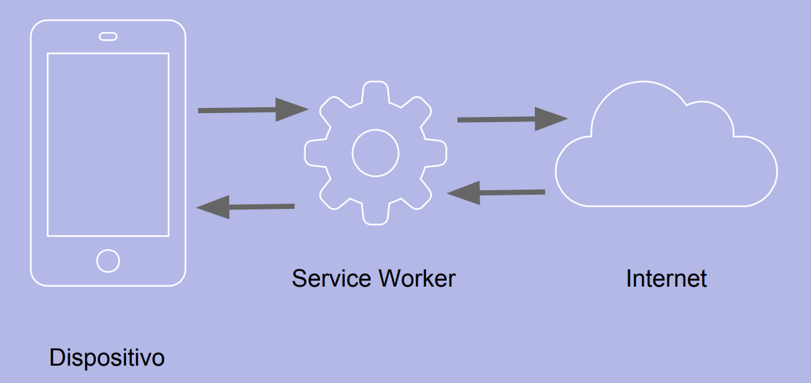

# Service Worker

## Qué son

Los service workers son **workers** dirigidos por **eventos**. Físicamente son archivos de javascript que pueden controlar la página en la que han sido **registrados** interceptado y modificando las peticiones y las respuestas.

Peculiaridades de los service workers:

- Se ejecutan en un contexto distinto (worker). Por lo tanto no tienen acceso al DOM, ni al localStorage...
- Se ejecutan en un hilo distinto al del javascript principal de la aplicación y son completamente asíncronos.
- Por seguridad, solamente funcionan sobre HTTPS para evitar ataques “man in the middle”.
- Algunos navegadores no permiten la ejecución de Service Workers en navegación privada.
- Funcionan con promesas.

https://developer.mozilla.org/es/docs/Web/API/Service_Worker_API

## Cómo funcionan

Los service workers interceptan TODAS las peticiones que realiza el navegador y pueden manipularlas a su antojo y emitir la respuesta original u otra respuesta distinta. 



Es por esto que su gran utilidad es que la web funcione incluso cuando no haya conexión a internet.

## Registro de un service worker

Un service worker debe ser registrado con javascript.

Es decir necesitamos que exista un javascript en el html que ejecute un código similar al siguiente:

```javascript
if ('serviceWorker' in navigator) {
  navigator.serviceWorker.register('/sw-test/sw.js', {scope: '/sw-test/'})
  .then(function(reg) {
    // registration worked
    console.log('Registration succeeded. Scope is ' + reg.scope);
  }).catch(function(error) {
    // registration failed
    console.log('Registration failed with ' + error);
  });
}
```

La url es relativa al origin, no relativa a la ubicación física del javascript en donde está el código de registro.

El scope es opcional. Indica qué parte de nuestra web estará bajo el control del Service Worker. 


## Ciclo de vida de un Service Worker

Una vez registrado, el service worker pasará por los siguientes estados:

- Installing
- Installed
- Activating
- Activated

Un Service Worker se descarga tan pronto como es registrado. Además, el navegador debe volver a descargarlo al menos cada 24 horas.

Si el fichero descargado es nuevo, se instala.

Una vez instalado, se activa. Si había otro service worker activo, el nuevo debe esperar hasta que deje de haber páginas que utilicen el service worker antiguo. 

## Eventos

- install: se produce justo antes de que el SW termine de instalarse
- activate: se produce justo antes de que el SW termine de activarse
- message: para intercambiar mensajes con el javascript principal
- fetch: se produce cada vez que el navegador realiza una petición
- sync: se produce cuando se recupera la conexión
- push: se produce cuando se recibe una notificación push

## Desisntalar un service worker

Para desinstalar un SW, hay que llamar al método **unregister()** del objeto *registration* correspondiente a nuestro SW. Existe un método **getRegistrations()** que nos devuelve todos los registros existentes.

```javascript
if ('serviceWorker' in navigator) {
  navigator.serviceWorker.getRegistrations()
  .then(function(registrations) {
    for(let registration of registrations) {
      registration.unregister()
    }
  })
}
```

## Fallos más comunes

- Nuestra aplicación no está en HTTPS

- El path de nuestro service worker no está bien escrito: 

Ejemplo:

Url del worker: https://mdn.github.io/sw-test/sw.js

Url de la aplicación: https://mdn.github.io/sw-test/

Origin: https://mdn.github.io

Url de registro: /sw-test/sw.js

- El service worker está en un origin diferente al de nuestra app.

- El SW solamente intercepta peticiones de clientes bajo el scope del SW.

- El scope de un service worker no puede ser mayor que su propia ubicación.

- Si la página se ha servico con la cabecera Service-Worker-Allowed, puede estar restringiendo el scope de nuestro SW.

- En Firefox no se permite el uso de SW en navegación privada

## Ejemplos de uso de Service Workers

Para sacar máximo partido de los service workers debemos conocer las siguientes apis de javascript:

- [Api Promises](https://github.com/carherco/curso-promesas)
- [Api Fetch](./api_fetch.md)
- [Api Cache](api_cache.md)

### Responder a una petición interceptada

```javascript
this.addEventListener('fetch', function(event) {
  console.log(event.request.url);
  event.respondWith(new Response('<h1>Estás sin conexión</h1>', {headers: { 'Content-Type': 'text/html'}}));
});
```

### Dar una respuesta cuando no hay red

```javascript
this.addEventListener('fetch', function(event) {
  if(!navigator.onLine) {
    event.respondWith(new Response('<h1>Estás sin conexión</h1>', {headers: { 'Content-Type': 'text/html'}}));
  } else {
    event.respondWith(fetch(event.request));
  }
});
```

### Cacheo inicial

```javascript
this.addEventListener('install', function(event) {
  event.waitUntil(
    caches.open('v1').then(function(cache) {
      return cache.addAll([
        '/sw-test/',
        '/sw-test/index.html',
        '/sw-test/style.css',
        '/sw-test/app.js',
        '/sw-test/image-list.js',
        '/sw-test/star-wars-logo.jpg',
        '/sw-test/gallery/',
        '/sw-test/gallery/bountyHunters.jpg',
        '/sw-test/gallery/myLittleVader.jpg',
        '/sw-test/gallery/snowTroopers.jpg'
      ]);
    })
  );
});
```

### Responder con un recurso cacheado

```javascript
this.addEventListener('fetch', function(event) {
  event.respondWith(
    caches.match(event.request)
  );
});
```

### Si no está en la cache, hacer la petición a la red

```javascript
this.addEventListener('fetch', function(event) {
  event.respondWith(
    caches.match(event.request).then(function(response) {
      return response || fetch(event.request);
    })
  );
});
```

### Si no está en la caché, cacheamos la respuesta de la red

```javascript
this.addEventListener('fetch', function(event) {
  event.respondWith(
    caches.match(event.request).then(function(resp) {
      return resp || fetch(event.request).then(function(response) {
        return caches.open('v1').then(function(cache) {
          cache.put(event.request, response.clone());
          return response;
        });  
      });
    })
  );
});
```

### Si no está en la caché, y no tenemos red, devolvemos algo

```javascript
this.addEventListener('fetch', function(event) {
  event.respondWith(
    caches.match(event.request).then(function(resp) {
      return resp || fetch(event.request).then(function(response) {
        caches.open('v1').then(function(cache) {
          cache.put(event.request, response.clone());
          return response;
        });
      });
    }).catch(function() {
      return new Response('<html><body>Sorry for de inconvenience</body></html>');
    })
  );
});
```


### Actualizar nuestro service worker

```javascript
this.addEventListener('install', function(event) {
  event.waitUntil(
    caches.open('v2').then(function(cache) {
      return cache.addAll([
        '/sw-test/',
        '/sw-test/index.html',
        '/sw-test/style.css',
        '/sw-test/app.js',
        '/sw-test/image-list.js',
        //...
      ]);
    })
  );
});
```

El nuevo Service Worker crea una nueva cache. De esta forma, no interfiere en el trabajo que esté todavía realizando el service worker anterior.

### Eliminar la cache del service worker anterior

Cuando el nuevo service worker por fin puede activarse, se dispara el evento **activate** que podemos aprovechar para que elimine la cache del service worker anterior.

```javascript
this.addEventListener('activate', function(event) {
  var cacheWhitelist = ['v2'];

  event.waitUntil(
    caches.keys().then(function(keyList) {
      return Promise.all(keyList.map(function(key) {
        if (cacheWhitelist.indexOf(key) === -1) {
          return caches.delete(key);
        }
      }));
    })
  );
});
```

### Intercambiar mensajes con los clientes

```javascript
self.addEventListener('message', function(event){
    console.log("SW Received Message: " + event.data);
});
```

```javascript
navigator.serviceWorker.controller.postMessage("Client 1 says '"+msg+"'");
```


Podemos ver más ejemplos en:

https://serviceworke.rs/